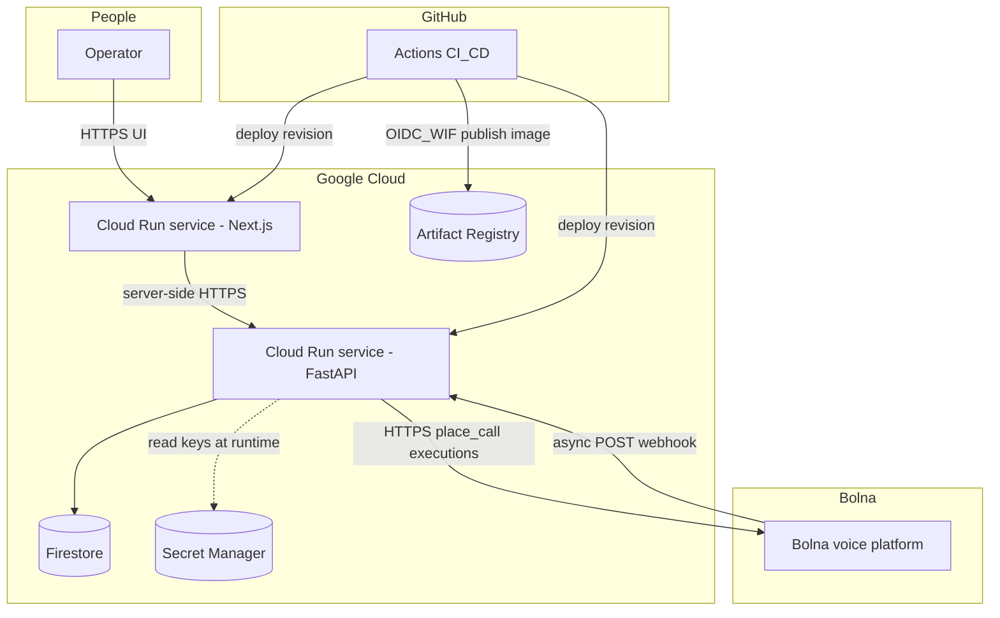
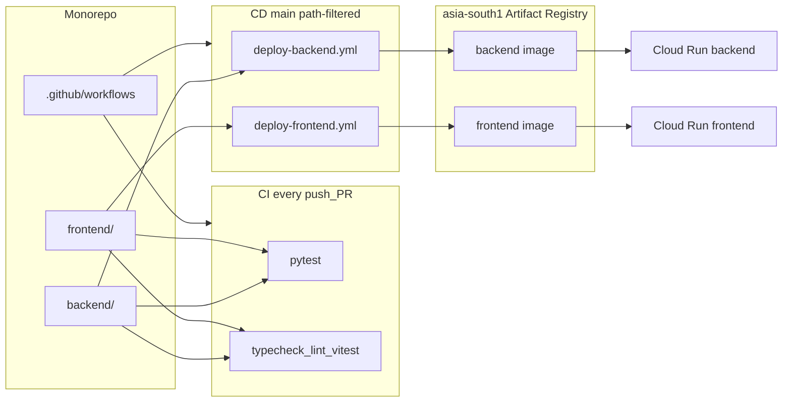
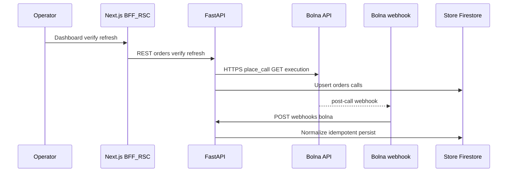
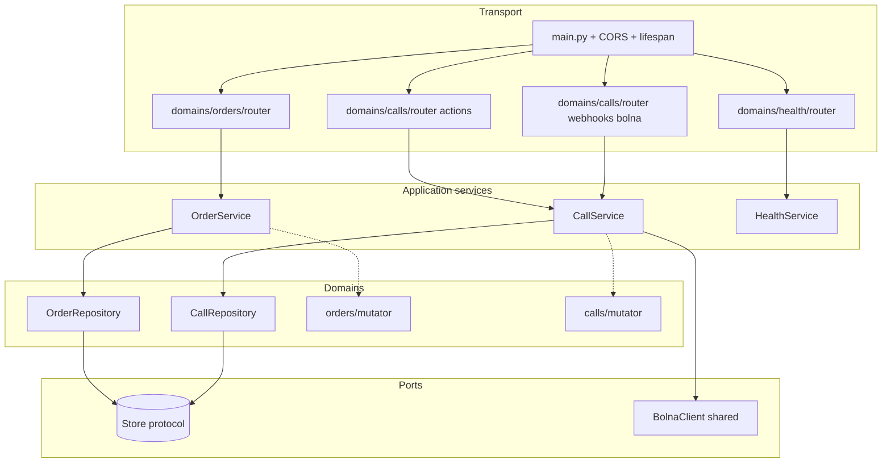
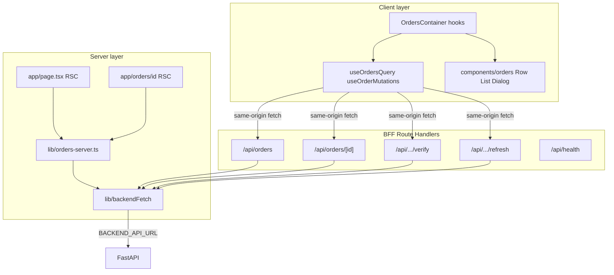

# RTO Shield — Pre-Dispatch Verification Ops Console

**RTO Shield** is a voice-AI-assisted **pre-dispatch verification** dashboard: operators trigger Bolna outbound calls against high–RTO-risk COD orders; the backend consumes **webhooks** and optional **execution polling**, persists state to **Firestore** in production, and the stack ships on **Google Cloud Run** with **Docker smoke tests** and **path-filtered CI/CD**.

A personal project exploring voice AI for logistics ops: a real enterprise use case (cutting COD RTO loss), a Bolna voice agent, a production web workflow, and a reproducible Cloud Run deployment. Full business framing lives in [`USE_CASE.md`](USE_CASE.md).

---

## Contents

1. [Overview](#overview)
2. [Live deployments](#live-deployments)
3. [Architecture](#architecture)
4. [Tech stack](#tech-stack)
5. [Project structure](#project-structure)
6. [Getting started](#getting-started)
7. [Configuration](#configuration)
8. [Testing](#testing)
9. [CI and deployment](#ci-and-deployment)
10. [API reference](#api-reference)
11. [Reliability and caveats](#reliability-and-caveats)
12. [Maintainer](#maintainer)
13. [License](#license)

---

## Overview

**Problem:** COD orders confirmed online often **reject, reschedule, or need address fixes at the doorstep** — direct margin and logistics loss (RTO tax).

**Product slice:** Operators run a short **Hindi/English Bolna voice check** before dispatch; outcomes update order rows (status, captures, transcript references).

**Operator flow:**

1. Orders appear on the dashboard (seeded demo in dev; **Firestore** in prod).
2. **Verify** → FastAPI asks Bolna to place the outbound call with order context (SKU, value, slot, etc.).
3. Call completes → Bolna **`POST`s webhook**; backend normalizes payload, persists call + order deltas.
4. If payload is incomplete (common with async extraction) → **Refresh** re-pulls **`GET /executions/{id}`** and reuses the same normalisation path.

**Outcome metric:** improve share of orders **confirmed dispatchable** vs **reschedule / address-change / cancel / unreachable** — full narrative + metrics framing in [`USE_CASE.md`](USE_CASE.md).

---

## Live deployments

Canonical **production** HTTPS endpoints (GCP **asia-south1** Cloud Run, `main` CI/CD). If a revision ever gets a **new URL**, update this table — same values belong in GitHub **`BACKEND_API_URL`** / **`NEXT_PUBLIC_BACKEND_API_URL`** and as **Bolna’s webhook target**.

| Surface | URL |
|---------|-----|
| **Frontend (dashboard)** | [bolna-frontend](https://bolna-frontend-3sacqleaea-el.a.run.app) — `https://bolna-frontend-3sacqleaea-el.a.run.app` |
| **Backend API (base)** | [bolna-backend](https://bolna-backend-3sacqleaea-el.a.run.app) — `https://bolna-backend-3sacqleaea-el.a.run.app` |
| **OpenAPI (Swagger)** | [ `/docs`](https://bolna-backend-3sacqleaea-el.a.run.app/docs) |
| **Backend health** (CI smoke path) | [`GET /health`](https://bolna-backend-3sacqleaea-el.a.run.app/health) |
| **Frontend BFF health** (CI smoke path) | [`GET /api/health`](https://bolna-frontend-3sacqleaea-el.a.run.app/api/health) |
| **Bolna webhook** | `POST https://bolna-backend-3sacqleaea-el.a.run.app/webhooks/bolna` |

---

## Architecture

Split into **HLD** (what exists in the system and how major pieces talk) and **LLD** (how the frontend and backend codebases are structured internally).

### HLD: System context (full project)

Logical view: **who** touches **which runtime**, and **where data + secrets** live. This is the “whole product” picture worth having before opening folders.



**Reading the diagram:**

- **Synchronous path:** Operator → Next (SSR/RSC + BFF routes) → FastAPI → (optional Bolna outbound when operator clicks Verify).
- **Asynchronous path:** Bolna terminates call → **`POST /webhooks/bolna`** → FastAPI updates `Store`; UI may Refresh to poll executions if webhook payload was thin.
- **State:** authoritative order + call snapshots in **Firestore** (prod) or memory (local/tests).
- **Secrets:** Bolna keys (and demo phone) sourced from **Secret Manager** in prod — not from the repo.
- **Supply chain:** images land in **Artifact Registry**; GitHub deploys both services with **WIF** (no long-lived GCP JSON keys in GitHub).

---

### HLD: Deployment and delivery

How the **repository** maps to **runtimes** and **pipelines** (still high level, but “DevOps aware”).



Each deploy workflow: **`docker build` → container smoke on runner → push digest → `gcloud run deploy`**. Plaintext tuning comes from **GitHub Variables**; sensitive values from **Secret Manager**.

---

### HLD: Data and control flows



---

### LLD: Backend (FastAPI)

**Layer model** enforced in-code: **`router` → `service` → `repository` → `Store`**. Cross-cutting **`mutator`** modules normalize external shapes (Bolna webhook / executions) before persistence. **`deps.py`** is the composition root for FastAPI DI.



**Module map (physical):**

| Path | Responsibility |
|------|----------------|
| `app/core/` | `settings`, **`db.Store` + InMemory + Firestore**, `deps`, lifespan wiring |
| `app/domains/orders/` | Orders CRUD, list, **`router`**, **`service`**, **`repository`**, **`mutator`**, Pydantic **`schemas`** |
| `app/domains/calls/` | Verify + refresh flow, webhook ingest, **`CallRepository`** idempotency, **`BolnaWebhookPayload`** |
| `app/shared/bolna_client.py` | `place_call`, `get_execution` over HTTPS |
| `app/domains/health/` | Liveness/readiness-style surface for ops |

---

### LLD: Frontend (Next.js App Router)

**Two data planes:** (1) **Server Components + `orders-server`** for first paint / SEO-safe data loading. (2) **Client Components + TanStack Query** calling **`/api/*` route handlers** so the browser never needs the FastAPI URL or secrets.



**Module map (`frontend/src/`):**

| Area | Responsibility |
|------|----------------|
| `app/` | RSC pages, **`api/**/route.ts`** BFF proxies, layout, loading, `api/health` for container smoke |
| `lib/` | `backendFetch`, `orders-server`, `api-response` helpers |
| `hooks/` | React Query wrappers + mutations + cache invalidation |
| `components/orders/` | Presentational dashboard + dialogs |
| `config/`, `constants/`, `types/`, `query-keys/` | Env, routes, enums, typed API models, query factories |
| `providers/` | `QueryClientProvider`, `Toaster` |

---

### Cross-cutting architectural decisions

| Topic | Approach |
|-------|----------|
| **Browser → APIs** | **BFF `/api/*`** keeps FastAPI origins and secrets off the public client surface. |
| **Persistence** | Domains speak **`Store`** only — swap **memory** vs **Firestore** without rewriting repositories. |
| **Voice unreliability** | **Webhook idempotency** + **`refresh` → executions API** share one normalisation pipeline. |


## Tech stack

| Layer | Choice | Why it fits |
|-------|--------|-------------|
| Voice | **Bolna** | Telephony + agent runtime + executions API. |
| API | **FastAPI**, Pydantic v2 | Async I/O, strict schemas, **`/docs` OpenAPI** for introspection. |
| Data | **Firestore** (prod), memory (dev/test) | Serverless affinity with Cloud Run; `STORE_BACKEND` toggles explicitly. |
| Web | **Next.js 16** App Router, **TypeScript** | RSC for first paint data; **`src/` layout** per `frontend/AGENTS.md`. |
| UI | **Tailwind v4**, **shadcn/ui**, **TanStack Query** | Accessible primitives + client cache invalidated after mutations. |
| Quality | **pytest**, **Vitest**, ESLint, `tsc` | Every branch gets API + UI gates in CI. |
| Ship | **Docker**, **Artifact Registry**, **Cloud Run** | Immutable image → regional deploy; scale-to-zero friendly. |
| CI → GCP | **GitHub OIDC + WIF** | Short-lived federation; avoids static GCP JSON keys in GitHub. |

---

## Project structure

```text
.
├── backend/                 # FastAPI — app/domains/{orders,calls}, shared/bolna_client
├── frontend/                # Next.js — application code under frontend/src/
├── .github/workflows/
│   ├── ci.yml               # All pushes/PRs — pytest + lint + typecheck + Vitest
│   ├── deploy-backend.yml   # main + backend/** — build → smoke → AR → Cloud Run
│   └── deploy-frontend.yml  # main + frontend/** — same pattern
├── USE_CASE.md              # Deep business + workflow write-up
└── AGENTS.md                # Pointer to frontend/backend contributor guides
```

**Conventions:** **frontend** → `frontend/AGENTS.md` (`src/` root). **backend** → `backend/AGENTS.md` (Router → Service → Repository → Mutator).

---

## Getting started

### Prerequisites

- **Python 3.12+**
- **Node.js 20+** and **npm 11** (matches Docker `corepack` path used in `frontend/Dockerfile`)
- **Docker** (optional; reproduces CI images locally)
- **`gcloud`** (only for GCP / Firestore touchpoints outside GitHub Actions)

### Backend

```bash
cd backend
python3 -m venv .venv && source .venv/bin/activate   # Windows: .venv\Scripts\activate
pip install -r requirements.txt -r requirements-dev.txt
cp .env.example .env    # fill from Configuration section below
export STORE_BACKEND=memory
uvicorn app.main:app --reload --port 8000
```

- **OpenAPI UI:** `http://localhost:8000/docs`
- **Liveness:** `GET /health`

### Frontend

```bash
cd frontend
npm install -g npm@11.8.0   # if local npm major mismatches lockfile / CI
npm ci
cp .env.example .env.local
npm run dev                 # http://localhost:3000
```

**Scripts:** `npm run lint` · `npm run typecheck` · `npm test`

---

## Configuration

Configuration is **layered**: laptop uses `.env` files; **production values are not committed** — they flow **GitHub Actions Variables / Secrets** → **Cloud Run env** and **GCP Secret Manager** (see [CI and deployment](#ci-and-deployment)).

### Backend — local / runtime keys

| Variable | Detail |
|----------|--------|
| `STORE_BACKEND` | `memory` (default, tests) or `firestore`. |
| `GCP_PROJECT_ID` | Required when `STORE_BACKEND=firestore`. |
| `BOLNA_API_KEY`, `BOLNA_AGENT_ID` | From Bolna console; in prod mounted via **Secret Manager** (see deploy workflow). |
| `BOLNA_API_BASE_URL` | Bolna REST origin; **set in GitHub Variable** for deploy (empty default in app code — must be provided when calling Bolna). |
| `DEMO_RECIPIENT_NUMBER` | Optional: route all demo calls to one verified MSISDN. |
| `BOLNA_WEBHOOK_SHARED_SECRET` | Optional weak guard in dev. |
| `CORS_ORIGINS` | Comma-separated; **cannot** be `*` while `allow_credentials=True` on FastAPI. |

Template: `backend/.env.example`.

### Frontend — local / runtime keys

| Variable | Detail |
|----------|--------|
| `BACKEND_API_URL` | **Server-only** — used by RSC and `src/lib/api.ts` (never ship secrets to the client bundle via this path). |
| `NEXT_PUBLIC_BACKEND_API_URL` | Build-time/public mirror; keep equal to the browser-reachable API origin when client code needs it. |

Template: `frontend/.env.example`. Local dev uses `http://localhost:8000` as DX fallback in `src/config/env.ts`; production always overrides via Cloud Run / build args.

---

## Testing

```bash
# Backend (in-memory store)
cd backend && export STORE_BACKEND=memory && pytest -q

# Frontend
cd frontend && npm run typecheck && npm run lint && npm test
```

---

## CI and deployment

### Continuous integration (`ci.yml`)

Runs on **every push and every pull request** (all branches): **pytest** and **typecheck + ESLint + Vitest** in parallel.

### Deploy workflows (only `main`)

| Workflow | Path filter | Pipeline |
|----------|-------------|----------|
| `deploy-backend.yml` | `backend/**` | `docker build` → run container → **`GET /health` smoke** → push `asia-south1-docker.pkg.dev/...` → `gcloud run deploy` |
| `deploy-frontend.yml` | `frontend/**` | Same → **`GET /api/health` smoke** (no backend dependency) → deploy |

**Preflight:** both workflows **fail fast** if required GitHub **Variables** are empty (no silent defaults baked into source).

**Runtime injection:** plaintext config from **`vars.*`**; Bolna keys from **GCP Secret Manager** via `--set-secrets` (secret *names* are fixed in workflow to match your GCP project — rotate values in Secret Manager, not in git).

### GitHub Actions — Variables (plaintext)

| Variable | Role |
|----------|------|
| `GCP_PROJECT_ID` | Project id in image URLs + backend `GCP_PROJECT_ID` |
| `GCP_REGION` | Cloud Run region + Artifact Registry hostname |
| `AR_REPO` | Docker repository id inside Artifact Registry |
| `BACKEND_CLOUD_RUN_SERVICE` | Backend Cloud Run service name |
| `FRONTEND_CLOUD_RUN_SERVICE` | Frontend Cloud Run service name |
| `STORE_BACKEND` | e.g. `firestore` on backend service |
| `BOLNA_API_BASE_URL` | Bolna API host for backend container |
| `CORS_ORIGINS` | Allowed browser origins (comma-separated values; **`deploy-backend`** bundles them via `^|^` delimiter in `--set-env-vars`.) |
| `BACKEND_API_URL` | FastAPI public URL for Next server-side fetches |
| `NEXT_PUBLIC_BACKEND_API_URL` | Docker build-arg + frontend service env mirror |

### GitHub Actions — Secrets

| Secret | Role |
|--------|------|
| `GCP_WIF_PROVIDER` | WIF provider resource string |
| `GCP_DEPLOY_SA` | Impersonated deployer SA |
| `BACKEND_RUNTIME_SA` | Identity of the **backend** Cloud Run revision (Firestore + secret accessor) |

### Post-deploy

Each successful job still prints the refreshed service URL into the **Actions summary** (`gcloud run services describe ...`). Canonical public URLs (including webhook) stay in **[Live deployments](#live-deployments)** above — Bolna webhook: `POST https://bolna-backend-3sacqleaea-el.a.run.app/webhooks/bolna`.

Implementation: [`backend/app/domains/calls/router.py`](backend/app/domains/calls/router.py).

---

## API reference

High-signal routes (full detail in OpenAPI **`/docs`** when the backend is running):

| Method | Path | Purpose |
|--------|------|---------|
| `GET` | `/health` | Liveness / CI smoke |
| `GET` | `/orders` | Paginated list (shape in orders router) |
| `POST` | `/orders` | Create order (demo / ops) |
| `PATCH` | `/orders/{id}` | Update customer / product fields (Bolna-derived fields untouched) |
| `DELETE` | `/orders/{id}` | Remove order + linked call docs |
| `GET` | `/orders/{id}` | Order + last call snapshot |
| `POST` | `/orders/{id}/verify` | Trigger Bolna outbound call |
| `POST` | `/orders/{id}/refresh` | Pull latest Bolna execution + reconcile |
| `GET` | `/orders/{id}/calls` | Call history for order |
| `POST` | `/webhooks/bolna` | Bolna post-call webhook |

Frontend mirrors mutations through **`/api/orders/...`** Next handlers (BFF).

---

## Reliability and caveats

1. **Webhooks:** deliveries can repeat; handler is **idempotent** and only “locks” processing when a **meaningful signal** exists (avoids starving late-arriving extractions).
2. **Execution lag:** Bolna `extracted_data` may land after `call-disconnected`; **`refresh`** is the supported reconciliation path.
3. **Transcript mining:** if structured extraction is empty but the assistant spoke tagged outcomes, backend applies a **narrow regex fallback** — **demo resilience**, not a replacement for fixing Bolna extraction in production.
4. **Firestore:** first complex list queries may require **composite indexes** (console suggests the exact YAML).
5. **CORS + credentials:** list every real HTTPS origin explicitly (frontend Cloud Run URL + `http://localhost:3000` for local UI).

---

## Maintainer

**Saurav Kumar** — AI voice integration (Bolna APIs + webhook/execution reconciliation), backend domain modelling and storage abstraction, Next.js/App Router frontend and BFF layer, Dockerfile + Cloud Run rollout, GitHub Actions (WIF, path deploys, smoke gates), and documentation of operational tradeoffs above.

---

## License

Personal project by Saurav Kumar. Third-party libraries remain under their respective licenses.
