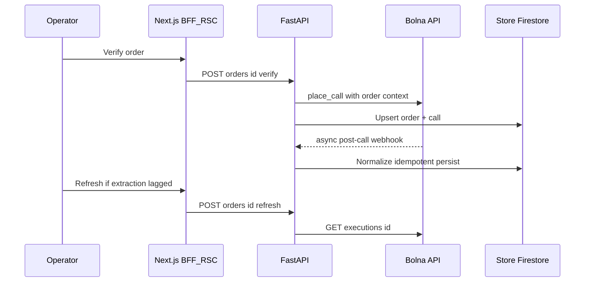

# RTO Shield

**Voice-AI pre-dispatch verification for COD e-commerce.** An ops console that calls the customer *before* the parcel ships — confirming intent, address, and delivery slot — so brands only dispatch orders that will actually be accepted.

[](https://github.com/Saurav02022/rto-shield/actions/workflows/ci.yml)


Indian D2C brands lose **25–35% of every COD shipment to RTO** (Return-To-Origin), at roughly **₹150–₹300 burned per failed delivery**. The usual playbook is reactive — ship, hope, eat the loss. SMS and WhatsApp confirmations get under 15% open rates and verify nothing. RTO Shield flips the order of operations: a 45-second Hindi/English voice call *before* dispatch turns a guess into a decision.

> **Why I built it:** it's a realistic slice of production voice-AI plumbing — async webhooks that arrive late, twice, or half-empty; a provider whose structured extraction lags the call-ended event; and a UI that has to stay truthful anyway. The full business framing (market numbers, metrics, scope) is in [`USE_CASE.md`](USE_CASE.md).

---

## Demo

<!--
  TODO: add a screenshot or GIF of the dashboard — the highest-impact thing this README is missing.
  Save it to docs/screenshot.png, then uncomment:

  
-->

_Screenshot pending._ Run it locally in ~2 minutes with the [quick start](#quick-start) below.

---

## How it works

1. Orders land on the dashboard — seeded in-memory locally, Firestore in the cloud.
2. Operator hits **Verify** → FastAPI asks Bolna to place an outbound call carrying order context (SKU, value, slot).
3. Call ends → Bolna `POST`s a webhook → the backend normalizes the payload and persists the outcome.
4. Extraction lagging behind the call? **Refresh** re-pulls `GET /executions/{id}` through the *same* normalisation path.

Every order resolves to one of: **confirmed dispatchable · reschedule · address-change · cancel · unreachable**. Ops ships only the first bucket.



---

## Quick start

**Prerequisites:** Python 3.12+ · Node.js 20+ · npm 11 · Docker (optional, reproduces the CI image)

**Backend** — runs fully offline against the in-memory store:

```bash
cd backend
python3 -m venv .venv && source .venv/bin/activate   # Windows: .venv\Scripts\activate
pip install -r requirements.txt -r requirements-dev.txt
cp .env.example .env
export STORE_BACKEND=memory
uvicorn app.main:app --reload --port 8000
```

→ API on `http://localhost:8000` · OpenAPI at [`/docs`](http://localhost:8000/docs) · health at `/health`

**Frontend:**

```bash
cd frontend
npm ci
cp .env.example .env.local
npm run dev
```

→ dashboard on `http://localhost:3000`

Placing real calls needs Bolna credentials (`BOLNA_API_KEY`, `BOLNA_AGENT_ID`) in `backend/.env`. Without them the dashboard and full CRUD still work — only **Verify** needs the provider. Every variable is documented in [`docs/DEPLOYMENT.md`](docs/DEPLOYMENT.md#configuration).

---

## Tests

```bash
cd backend && STORE_BACKEND=memory pytest -q          # API
cd frontend && npm run typecheck && npm run lint && npm test   # UI
```

Both run on every push and PR via [`ci.yml`](.github/workflows/ci.yml).

---

## Tech stack

| Layer | Choice | Why |
|-------|--------|-----|
| Voice | **Bolna** | Telephony + agent runtime + executions API in one provider. |
| API | **FastAPI**, Pydantic v2 | Async I/O, strict schemas, OpenAPI for free. |
| Data | **Firestore** (cloud), memory (dev/test) | Serverless affinity with Cloud Run; `STORE_BACKEND` toggles explicitly. |
| Web | **Next.js 16** App Router, **TypeScript** | RSC for first paint; BFF routes keep the API private. |
| UI | **Tailwind v4**, **shadcn/ui**, **TanStack Query** | Accessible primitives; cache invalidated after mutations. |
| Quality | **pytest**, **Vitest**, ESLint, `tsc` | API + UI gates on every branch. |
| Ship | **Docker**, **Artifact Registry**, **Cloud Run** | Immutable image → regional deploy, scale-to-zero. |
| CI → GCP | **GitHub OIDC + WIF** | Short-lived federation; no static JSON keys in GitHub. |

---

## Engineering notes

The parts that were actually interesting to build:

- **Webhooks lie.** Deliveries repeat, and Bolna's `extracted_data` frequently lands *after* `call-disconnected`. The handler is idempotent and only locks an order once a **meaningful** signal exists — otherwise a fast, empty webhook would starve the real payload. `refresh` re-pulls the execution through the identical normalisation path, so there's one code path to trust, not two that drift.
- **Storage is a port, not a database.** Domains speak a `Store` protocol: `memory` backs local dev and the entire test suite, Firestore backs the cloud. Swapping backends rewrites no repository.
- **The browser never sees the API.** Next route handlers under `/api/*` proxy server-side to FastAPI, keeping the API origin and provider keys out of the client bundle.
- **CI gates the image, not just the code.** Both deploy workflows build the container, boot it on the runner, and curl its health endpoint *before* anything is pushed to a registry.

**Known caveats:** the transcript regex fallback is demo resilience, not a substitute for fixing extraction upstream; Firestore may want composite indexes for complex list queries; CORS must enumerate real origins (`*` is illegal alongside credentials).

---

## Layout

```text
├── backend/      FastAPI — domains/{orders,calls,health}, shared/bolna_client
├── frontend/     Next.js App Router — application code under src/
├── docs/         Architecture + deployment reference
└── USE_CASE.md   Business framing: problem, metrics, scope
```

Contributor conventions live in [`backend/AGENTS.md`](backend/AGENTS.md) (Router → Service → Repository → Mutator) and [`frontend/AGENTS.md`](frontend/AGENTS.md) (`src/` layout).

---

## Deployment

Built to ship on **Google Cloud Run**: Docker → Artifact Registry → Cloud Run, deployed from GitHub Actions via **OIDC / Workload Identity Federation** (no long-lived service-account keys in GitHub).

> **Status:** the original cloud deployment is **offline** — it lived in a GCP project that has since been decommissioned. The deploy workflows are kept as reference and are **manual-only** (`workflow_dispatch`); point them at your own GCP project to bring it back up. Everything runs locally via the [quick start](#quick-start).

Setup, configuration reference, and the full variable/secret matrix: [`docs/DEPLOYMENT.md`](docs/DEPLOYMENT.md).

---

## Docs

| Doc | What's in it |
|-----|--------------|
| [`docs/ARCHITECTURE.md`](docs/ARCHITECTURE.md) | HLD + LLD diagrams, module maps, API surface, design decisions |
| [`docs/DEPLOYMENT.md`](docs/DEPLOYMENT.md) | CI/CD pipelines, GCP setup, configuration reference |
| [`USE_CASE.md`](USE_CASE.md) | The business case: market numbers, metrics, scope, risks |

---

## Author

**Saurav Kumar** — [GitHub](https://github.com/Saurav02022)

Built end to end: the Bolna voice integration and webhook/execution reconciliation, backend domain modelling and the storage abstraction, the Next.js App Router frontend and BFF layer, Docker + Cloud Run rollout, and the GitHub Actions pipeline (WIF federation, containerised smoke gates, path-filtered CI).

## License

Personal project by Saurav Kumar. Third-party libraries remain under their respective licenses.
