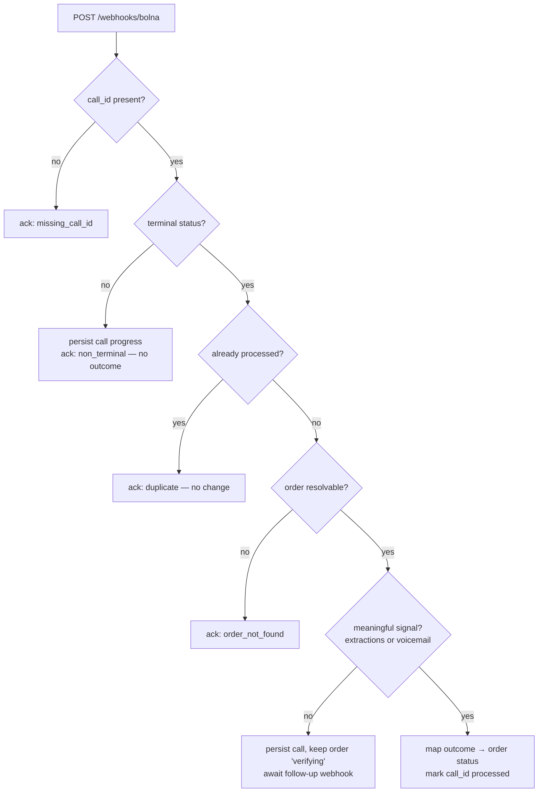

# RTO Shield

A voice-AI ops console that phones a cash-on-delivery customer *before* the parcel ships, so a brand only dispatches orders the customer actually confirmed. The genuinely hard part isn't the phone call — it's that the provider's post-call webhook arrives late, more than once, and often half-empty, and the order state has to stay correct through all of that.

Python · FastAPI · Next.js 16 · Bolna voice API · *(open-ended take-home; runs end to end on seed data)*

> It runs on three seeded demo orders (`ORD-1001…1003`) — no real order numbers, no production traffic, no measured RTO figures anywhere in here. The business framing (market size, the RTO problem, scope) lives in [`USE_CASE.md`](USE_CASE.md); treat those numbers as industry context, not results this app produced.

## Contents

1. [What it does](#what-it-does)
2. [Architecture](#architecture)
3. [Where things live](#where-things-live)
4. [The hard part: idempotent, out-of-order webhooks](#the-hard-part-idempotent-out-of-order-webhooks)
5. [Invariants the system holds](#invariants-the-system-holds)
6. [Design decisions (and the alternatives I turned down)](#design-decisions-and-the-alternatives-i-turned-down)
7. [API surface](#api-surface)
8. [A call, webhook by webhook](#a-call-webhook-by-webhook)
9. [Tests](#tests)
10. [Run it locally](#run-it-locally)
11. [Deployment](#deployment)
12. [Known limitations](#known-limitations)

---

## What it does

An operator opens the dashboard, sees the COD orders, and clicks **Verify** on one:

1. FastAPI asks Bolna to place an outbound call, handing it the order context (customer, product, value, address, slot) as agent variables.
2. The agent runs a short scripted call — confirm intent, check the address, confirm the delivery slot — and hangs up.
3. Bolna `POST`s a post-call webhook. The backend normalises it and maps the call outcome onto the order.
4. If the structured extraction hasn't landed yet (Bolna's extraction step runs asynchronously, after the call already disconnected), the operator hits **Refresh**, which pulls `GET /executions/{id}` and replays it through the *same* code path.

Every order lands in exactly one bucket: `ship_approved`, `address_correction_requested`, `reschedule_requested`, `cancelled`, `needs_followup`, or `unreachable`. Ops ships the first bucket and handles the rest before the courier is ever booked.

## Architecture

Two services in a monorepo. A FastAPI backend does the real work; a Next.js App Router frontend is the console and a thin BFF in front of the API.

The backend is layered the same way in every domain:

```
router  →  service  →  repository  →  Store (protocol)
                  ↘  mutator (pure normalisation of external shapes)
```

- **`router`** — FastAPI transport only. Parses the request, calls the service, returns a schema.
- **`service`** — orchestration and the actual decisions (`CallService`, `OrderService`).
- **`repository`** — a narrow wrapper over the `Store` protocol; no business logic.
- **`Store`** — an async `Protocol` (`app/core/db.py`) with two implementations: `InMemoryStore` (dict-backed, used by every test and by local dev) and `FirestoreStore` (Cloud Firestore, used in the cloud). `STORE_BACKEND` picks one at startup; nothing above the repository knows which is live.
- **`mutator`** — pure functions, no I/O or clocks, that turn Bolna's loose payloads and order edits into clean records. All the fiddly "Bolna might send this under five different keys" logic lives here and is unit-testable in isolation.

The frontend never talks to FastAPI directly from the browser. Client components call same-origin `/api/*` route handlers, which proxy server-side through `backendFetch`, keeping `BACKEND_API_URL` out of the client bundle. Server Components load the first paint through the same fetcher.

Domain conventions are written up in [`backend/AGENTS.md`](backend/AGENTS.md) and [`frontend/AGENTS.md`](frontend/AGENTS.md); the deeper HLD/LLD diagrams are in [`docs/ARCHITECTURE.md`](docs/ARCHITECTURE.md).

## Where things live

The backend is the interesting half. Everything routes through the layered path above:

```
backend/app/
  main.py                        FastAPI app assembly + router wiring
  lifespan.py                    startup/shutdown: open the Store, seed demo orders
  core/
    db.py                        the Store Protocol + InMemoryStore + FirestoreStore
                                 + make_store() (chooses backend from STORE_BACKEND)
    settings.py  deps.py         env config; FastAPI dependency wiring
    auth.py                      501 stub — present, wired to nothing (see limitations)
    exceptions.py                AppError → HTTP status mapping
  shared/
    bolna_client.py              hand-rolled ~114-line httpx client: place_call + get_execution
    constants.py  validators.py  timeouts, phone/field helpers
  domains/
    calls/
      service.py                 CallService — verify, the webhook funnel, the refresh replay
      mutator.py                 pure normalisation of Bolna payloads + transcript-mining fallback
      repository.py  schemas.py  Store wrapper for calls + idempotency; Pydantic models
      router.py                  /orders/{id}/verify, /refresh, /calls, /webhooks/bolna
    orders/
      service.py  mutator.py     order CRUD + apply_call_outcome (outcome tag → order status)
      seed.py                    the three demo orders
      router.py  repository.py  schemas.py
    health/                      /health liveness (also the CI container smoke check)
backend/tests/                   19 pytest, all offline against InMemoryStore
frontend/src/                    App Router pages, /api BFF route handlers, hooks, 14 Vitest
docs/                            ARCHITECTURE.md (HLD/LLD), DEPLOYMENT.md
```

If you only read two files, read `domains/calls/service.py` (the webhook state machine and the signal gate) and `core/db.py` (the `Store` seam that makes the whole thing testable offline).

## The hard part: idempotent, out-of-order webhooks

Bolna's delivery is best-effort. A single call produces a stream of webhooks — `initiated`, `ringing`, `in-progress`, then `call-disconnected` — and the useful `extracted_data` frequently arrives in a *second* terminal webhook, after an empty first one. Deliveries also repeat. So the handler has to survive three things at once: intermediate noise, duplicates, and a terminal event that arrives before the data it's supposed to carry.

`CallService.handle_webhook` (`app/domains/calls/service.py`) is the single funnel for all of it. Two ideas do the work:

- **Idempotency keyed on the call id.** The identifier Bolna sends as `id` is the key. Once an order has been finalised from a call, that call id is written to a `processed` set; a later duplicate short-circuits to a `duplicate` ack and changes nothing.
- **A signal gate.** An order is only marked done — and the call id only marked processed — once a *meaningful* signal exists (real extractions, or a voicemail flag). A terminal-but-empty webhook is persisted as progress but leaves the order in `verifying`, so a fast, empty `call-disconnected` can't overwrite the real outcome that's still on its way.



**One replay path, not two.** `Refresh` (`POST /orders/{id}/refresh`) pulls the canonical execution with `GET /executions/{id}` and feeds the response straight into `handle_webhook` — the executions payload and the webhook payload share a shape, so there's one normalisation pipeline to trust instead of two that drift. `?force=true` clears the processed mark first, which is how a late extraction gets re-applied to an order that already went terminal-empty. This is also the recovery path after the in-memory store is wiped by a restart.

One more wrinkle worth flagging: Bolna doesn't echo our `order_id` back in the webhook (it only persists keys declared as agent variables). So the handler resolves the order from the call record we wrote at trigger time, which always carries the linkage.

### The Bolna client

`app/shared/bolna_client.py` is a hand-rolled ~114-line `httpx` wrapper, not an SDK — two methods (`place_call`, `get_execution`), a typed `BolnaError` that carries the upstream status code, and per-request `AsyncClient` instances with a shared timeout. That's the whole integration surface. When Bolna's structured extraction is silent but the agent spoke its tagged outcome aloud, `mutator.py` mines it back out of the transcript with a small set of regexes — deliberately a demo-resilience fallback, not a substitute for fixing extraction upstream.

## Invariants the system holds

These hold no matter what order the webhooks arrive in or how many times they repeat:

| Invariant | Enforced by |
|---|---|
| A call is **applied to an order at most once** | idempotency set keyed on `call_id`; `already_processed` short-circuits before any order write (`service.py`) |
| An order is marked done **only once a real outcome arrives** — an early empty terminal webhook can't overwrite it | the signal gate: `mark_processed` / `apply_call_outcome` run only when `has_signal` (extractions or voicemail) is true (`service.py`) |
| Domain logic **only ever talks to the `Store` interface** | repositories depend on the `Store` Protocol, never a concrete backend; in-memory (tests) and Firestore (prod) are swapped by `STORE_BACKEND` with nothing above the repo changing |
| Editing an order **never touches Bolna-derived fields** | `PATCH /orders/{id}` merges only operator/customer fields; call outcome, transcript, and status come from the webhook path alone (`orders/mutator.py`) |
| A deleted order **takes its linked calls with it** | `delete_order` cascades to the call records and their processed marks in both store implementations (`core/db.py`) |

## Design decisions (and the alternatives I turned down)

- **A ports-and-adapters `Store` Protocol, not coupling the domain to the Firestore SDK.** Coupling to Firestore directly would have been fewer lines, but then no test could run without cloud credentials. The `Store` seam lets the entire suite run in-memory and offline, and made "add Postgres later" a new adapter rather than a refactor. The cost is one interface with two implementations — worth it the first time CI ran green with no network.
- **One handler for both the webhook push and the on-demand re-pull, not two code paths.** `GET /executions/{id}` and the webhook `POST` carry the same shape, so `refresh` normalises its response and calls `handle_webhook`. Two separate handlers would drift — a bug fixed in one, missed in the other. One funnel means the idempotency and signal-gate logic can only be right or wrong once.
- **The signal gate marks done on a *real outcome*, not on any terminal webhook.** The obvious version finalises the order the moment `call-disconnected` arrives. But Bolna routinely fires that empty and delivers `extracted_data` in a later terminal webhook — so "finalise on terminal" would swallow the real result with the empty one. Gating on a meaningful signal costs an extra webhook round-trip in the common case and buys correctness in the racey one.
- **A hand-rolled `httpx` client, not an SDK.** The integration surface is two endpoints. A ~114-line typed wrapper with one error type is easier to read, test, and reason about than pulling in and pinning a dependency for two calls I fully control.
- **The webhook always returns `200`, with the real result in the body.** Returning a 4xx/5xx would make Bolna retry on its own schedule, multiplying the duplicate load the idempotency set already has to absorb. Instead the ack body (`applied`, `reason`) is informational, and `refresh` is the deterministic way to re-drive a call — retries are on our terms, not the provider's.

## API surface

FastAPI, JSON in and out. Full schema at `/docs` when the server is running.

| Method | Path | Purpose |
|--------|------|---------|
| `GET` | `/health` | Liveness — also the container smoke check in CI |
| `GET` | `/orders` | List orders |
| `POST` | `/orders` | Create an order (pending verification) |
| `GET` | `/orders/{id}` | Order + its latest call outcome |
| `PATCH` | `/orders/{id}` | Edit customer/ops fields (Bolna-derived fields untouched) |
| `DELETE` | `/orders/{id}` | Delete an order and its linked calls |
| `POST` | `/orders/{id}/verify` | Place a Bolna outbound call |
| `POST` | `/orders/{id}/refresh` | Re-pull the execution and reconcile |
| `GET` | `/orders/{id}/calls` | Call history for an order, newest first |
| `POST` | `/webhooks/bolna` | Bolna post-call webhook (always `200`, body is informational) |

## A call, webhook by webhook

The signal gate is easiest to see as a sequence. Operator clicks **Verify** on `ORD-1001`; the order goes to `verifying` and the call id is linked. Then Bolna delivers:

| Webhook | `status` | extractions | Handler does | Order after |
|---|---|---|---|---|
| 1 | `ringing` | — | non-terminal → persist progress | `verifying` |
| 2 | `call-disconnected` | *empty* | terminal, but **no signal** → persist call, don't finalise | `verifying` |
| 3 | `call-disconnected` | `outcome_tag: confirmed` | terminal + signal → map outcome, mark processed | `ship_approved` |
| 4 | `call-disconnected` | `outcome_tag: confirmed` | duplicate → `already_processed`, no change | `ship_approved` |

Webhook 2 is the trap the gate exists for: the naive "finalise on terminal" would have stamped the order done with no outcome, and webhook 3 would have been rejected as a duplicate. If webhook 3 never arrives, the operator hits **Refresh**, which pulls the execution and runs the same path — reaching the same `ship_approved` deterministically.

## Tests

**19 pytest, 14 Vitest.** The backend suite runs fully offline against `InMemoryStore` and covers the parts that carry risk: the webhook state machine (duplicates, non-terminal noise, terminal-empty-then-populated ordering), outcome-tag normalisation, the transcript-mining fallback, order CRUD, and the seed/reconcile helpers. The frontend tests cover the API-response envelope, order-status rendering, and the orders row. Both suites run on every push and PR via [`ci.yml`](.github/workflows/ci.yml) (backend `pytest` with `STORE_BACKEND=memory`; frontend `typecheck` + `lint` + `test`).

## Run it locally

**Prerequisites:** Python 3.12+ · Node 20+ · npm 11 · Docker (optional, reproduces the CI image).

**Backend** — runs fully offline on the in-memory store:

```bash
cd backend
python3 -m venv .venv && source .venv/bin/activate   # Windows: .venv\Scripts\activate
pip install -r requirements.txt -r requirements-dev.txt
cp .env.example .env
export STORE_BACKEND=memory
uvicorn app.main:app --reload --port 8000
```

API on `http://localhost:8000`, OpenAPI at `/docs`, health at `/health`. The store seeds three demo orders on first boot so the dashboard isn't empty.

**Frontend:**

```bash
cd frontend
npm ci
cp .env.example .env.local
npm run dev        # http://localhost:3000
```

Placing a real call needs `BOLNA_API_KEY` and `BOLNA_AGENT_ID` in `backend/.env` (and, on the trial plan, a verified `DEMO_RECIPIENT_NUMBER` to route to). Without them the dashboard, CRUD, and everything except **Verify** still work. Every variable is documented in [`docs/DEPLOYMENT.md`](docs/DEPLOYMENT.md).

**Tests:**

```bash
cd backend && STORE_BACKEND=memory pytest -q
cd frontend && npm run typecheck && npm run lint && npm test
```

## Deployment

Built to run on Google Cloud Run: Docker image → Artifact Registry → Cloud Run, deployed from GitHub Actions authenticating keyless via **OIDC / Workload Identity Federation** (no long-lived service-account JSON in GitHub). Each deploy workflow builds the container, boots it on the runner, and `curl`s `/health` before anything is pushed to a registry — the image is gated, not just the source.

**Status:** the original cloud deployment is offline — the GCP project it lived in has been decommissioned. The deploy workflows are kept as reference and are `workflow_dispatch`-only; point them at your own project to bring it back. Everything above runs locally without any of it.

## Known limitations

Honest about what this is — an open-ended take-home on seed data:

- **Auth is a stub.** `app/core/auth.py` exists but `require_auth_context` just raises `501` and is wired to no route. Every endpoint is currently open.
- **The webhook is unauthenticated.** `/webhooks/bolna` does no signature verification — anyone who can reach it can drive order state. Fine for a take-home on seed data; a real deployment needs a shared-secret or signature check here first.
- **Single-process idempotency in dev.** The in-memory `processed` set is per-process and resets on restart. Firestore makes it durable in the cloud, but there's no cross-instance locking, so two webhooks racing on the same call id could both pass the gate. `refresh` is the deterministic backstop.
- **Firestore composite indexes.** The first complex list queries will want composite indexes; the console prints the exact YAML when they do.
- **Transcript regex is a fallback, not a plan.** It buys demo resilience when extraction lags; the real fix is upstream in the agent's extraction config.
- **CORS must enumerate real origins** — `*` is illegal while `allow_credentials=True`.
