# RTO Shield

A voice-AI ops console that phones a cash-on-delivery customer *before* the parcel ships, so a brand only dispatches orders the customer actually confirmed. The genuinely hard part isn't the phone call — it's that the provider's post-call webhook arrives late, more than once, and often half-empty, and the order state has to stay correct through all of that.

Python · FastAPI · Next.js 16 · Bolna voice API · a voice console you can drive end to end on seed data

> This is an open-ended take-home. It runs on three seeded demo orders (`ORD-1001…1003`) — there are no real order numbers, no production traffic, and no measured RTO figures in here. The business framing (market size, the RTO problem, scope) lives in [`USE_CASE.md`](USE_CASE.md); treat those numbers as industry context, not results this app produced.

---

## What it does

An operator opens the dashboard, sees the COD orders, and clicks **Verify** on one:

1. FastAPI asks Bolna to place an outbound call, handing it the order context (customer, product, value, address, slot) as agent variables.
2. The agent runs a short scripted call — confirm intent, check the address, confirm the delivery slot — and hangs up.
3. Bolna `POST`s a post-call webhook. The backend normalises it and maps the call outcome onto the order.
4. If the structured extraction hasn't landed yet (Bolna's extraction step runs asynchronously, after the call already disconnected), the operator hits **Refresh**, which pulls `GET /executions/{id}` and replays it through the *same* code path.

Every order lands in exactly one bucket: `ship_approved`, `address_correction_requested`, `reschedule_requested`, `cancelled`, `needs_followup`, or `unreachable`. Ops ships the first bucket and handles the rest before the courier is ever booked.

---

## Architecture

Two services in a monorepo. A FastAPI backend does the real work; a Next.js App Router frontend is the console and a thin BFF in front of the API.

The backend is layered the same way in every domain:

```
router  →  service  →  repository  →  Store (protocol)
                  ↘  mutator (pure normalisation of external shapes)
```

- **`router`** — FastAPI transport only. Parses the request, calls the service, returns a schema.
- **`service`** — orchestration and the actual decisions (`CallService`, `OrderService`).
- **`repository`** — a narrow wrapper over the `Store` protocol; no business logic.
- **`Store`** — an async `Protocol` (`app/core/db.py`) with two implementations: `InMemoryStore` (dict-backed, used by every test and by local dev) and `FirestoreStore` (Cloud Firestore, used in the cloud). `STORE_BACKEND` picks one at startup; nothing above the repository knows which is live.
- **`mutator`** — pure functions, no I/O or clocks, that turn Bolna's loose payloads and order edits into clean records. All the fiddly "Bolna might send this under five different keys" logic lives here and is unit-testable in isolation.

The frontend never talks to FastAPI directly from the browser. Client components call same-origin `/api/*` route handlers, which proxy server-side through `backendFetch`, keeping `BACKEND_API_URL` out of the client bundle. Server Components load the first paint through the same fetcher.

Domain conventions are written up in [`backend/AGENTS.md`](backend/AGENTS.md) and [`frontend/AGENTS.md`](frontend/AGENTS.md); the deeper HLD/LLD diagrams are in [`docs/ARCHITECTURE.md`](docs/ARCHITECTURE.md).

---

## The hard part: idempotent, out-of-order webhooks

Bolna's delivery is best-effort. A single call produces a stream of webhooks — `initiated`, `ringing`, `in-progress`, then `call-disconnected` — and the useful `extracted_data` frequently arrives in a *second* terminal webhook, after an empty first one. Deliveries also repeat. So the handler has to survive three things at once: intermediate noise, duplicates, and a terminal event that arrives before the data it's supposed to carry.

`CallService.handle_webhook` (`app/domains/calls/service.py`) is the single funnel for all of it. Two ideas do the work:

- **Idempotency keyed on the call id.** The identifier Bolna sends as `id` is the key. Once an order has been finalised from a call, that call id is written to a `processed` set; a later duplicate short-circuits to a `duplicate` ack and changes nothing.
- **A signal gate.** An order is only marked done — and the call id only marked processed — once a *meaningful* signal exists (real extractions, or a voicemail flag). A terminal-but-empty webhook is persisted as progress but leaves the order in `verifying`, so a fast, empty `call-disconnected` can't overwrite the real outcome that's still on its way.

```mermaid
flowchart TD
  W["POST /webhooks/bolna"] --> CID{call_id present?}
  CID -- no --> IGN["ack: missing_call_id"]
  CID -- yes --> TERM{terminal status?}
  TERM -- no --> PROG["persist call progress<br/>ack: non_terminal — no outcome"]
  TERM -- yes --> DUP{already processed?}
  DUP -- yes --> SKIP["ack: duplicate — no change"]
  DUP -- no --> ORD{order resolvable?}
  ORD -- no --> NF["ack: order_not_found"]
  ORD -- yes --> SIG{meaningful signal?<br/>extractions or voicemail}
  SIG -- no --> WAIT["persist call, keep order 'verifying'<br/>await follow-up webhook"]
  SIG -- yes --> APPLY["map outcome → order status<br/>mark call_id processed"]
```



**One replay path, not two.** `Refresh` (`POST /orders/{id}/refresh`) pulls the canonical execution with `GET /executions/{id}` and feeds the response straight into `handle_webhook` — the executions payload and the webhook payload share a shape, so there's one normalisation pipeline to trust instead of two that drift. `?force=true` clears the processed mark first, which is how a late extraction gets re-applied to an order that already went terminal empty. This is also the recovery path after the in-memory store is wiped by a restart.

One more wrinkle worth flagging: Bolna doesn't echo our `order_id` back in the webhook (it only persists keys declared as agent variables). So the handler resolves the order from the call record we wrote at trigger time, which always carries the linkage.

### The Bolna client

`app/shared/bolna_client.py` is a hand-rolled ~110-line `httpx` wrapper, not an SDK — two methods (`place_call`, `get_execution`), a typed `BolnaError` that carries the upstream status code, and per-request `AsyncClient` instances with a shared timeout. That's the whole integration surface. When Bolna's structured extraction is silent but the agent spoke its tagged outcome aloud, `mutator.py` mines it back out of the transcript with a small set of regexes — deliberately a demo-resilience fallback, not a substitute for fixing extraction upstream.

---

## API surface

FastAPI, JSON in and out. Full schema at `/docs` when the server is running.

| Method | Path | Purpose |
|--------|------|---------|
| `GET` | `/health` | Liveness — also the container smoke check in CI |
| `GET` | `/orders` | List orders |
| `POST` | `/orders` | Create an order (pending verification) |
| `GET` | `/orders/{id}` | Order + its latest call outcome |
| `PATCH` | `/orders/{id}` | Edit customer/ops fields (Bolna-derived fields untouched) |
| `DELETE` | `/orders/{id}` | Delete an order and its linked calls |
| `POST` | `/orders/{id}/verify` | Place a Bolna outbound call |
| `POST` | `/orders/{id}/refresh` | Re-pull the execution and reconcile |
| `GET` | `/orders/{id}/calls` | Call history for an order, newest first |
| `POST` | `/webhooks/bolna` | Bolna post-call webhook (always `200`, body is informational) |

The webhook always returns `200` so Bolna won't retry on our account; the ack body (`applied`, `reason`) says what actually happened.

---

## Tests & limitations

**19 pytest, 14 Vitest.** The backend suite runs fully offline against `InMemoryStore` and covers the parts that carry risk: the webhook state machine (duplicates, non-terminal noise, terminal-empty-then-populated ordering), outcome-tag normalisation, the transcript-mining fallback, order CRUD, and the seed/reconcile helpers. The frontend tests cover the API-response envelope, order-status rendering, and the orders row. Both suites run on every push and PR via [`ci.yml`](.github/workflows/ci.yml) (backend `pytest` with `STORE_BACKEND=memory`; frontend `typecheck` + `lint` + `test`).

Known limitations, honestly:

- **Auth is a stub.** `app/core/auth.py` exists but `require_auth_context` just raises `501` and is wired to no route. Every endpoint is currently open.
- **The webhook is unauthenticated.** `/webhooks/bolna` does no signature verification — anyone who can reach it can drive order state. Fine for a take-home on seed data; a real deployment needs a shared-secret or signature check here first.
- **Single-process idempotency in dev.** The in-memory `processed` set is per-process and resets on restart. Firestore makes it durable in the cloud, but there's no cross-instance locking, so two webhooks racing on the same call id could both pass the gate. `refresh` is the deterministic backstop.
- **Firestore composite indexes.** The first complex list queries will want composite indexes; the console prints the exact YAML when they do.
- **Transcript regex is a fallback, not a plan.** It buys demo resilience when extraction lags; the real fix is upstream in the agent's extraction config.
- **CORS must enumerate real origins** — `*` is illegal while `allow_credentials=True`.

---

## Run it locally

**Prerequisites:** Python 3.12+ · Node 20+ · npm 11 · Docker (optional, reproduces the CI image).

**Backend** — runs fully offline on the in-memory store:

```bash
cd backend
python3 -m venv .venv && source .venv/bin/activate   # Windows: .venv\Scripts\activate
pip install -r requirements.txt -r requirements-dev.txt
cp .env.example .env
export STORE_BACKEND=memory
uvicorn app.main:app --reload --port 8000
```

API on `http://localhost:8000`, OpenAPI at `/docs`, health at `/health`. The store seeds three demo orders on first boot so the dashboard isn't empty.

**Frontend:**

```bash
cd frontend
npm ci
cp .env.example .env.local
npm run dev        # http://localhost:3000
```

Placing a real call needs `BOLNA_API_KEY` and `BOLNA_AGENT_ID` in `backend/.env` (and, on the trial plan, a verified `DEMO_RECIPIENT_NUMBER` to route to). Without them the dashboard, CRUD, and everything except **Verify** still work. Every variable is documented in [`docs/DEPLOYMENT.md`](docs/DEPLOYMENT.md).

**Tests:**

```bash
cd backend && STORE_BACKEND=memory pytest -q
cd frontend && npm run typecheck && npm run lint && npm test
```

---

## Deployment

Built to run on Google Cloud Run: Docker image → Artifact Registry → Cloud Run, deployed from GitHub Actions authenticating keyless via **OIDC / Workload Identity Federation** (no long-lived service-account JSON in GitHub). Each deploy workflow builds the container, boots it on the runner, and `curl`s `/health` before anything is pushed to a registry — the image is gated, not just the source.

**Status:** the original cloud deployment is offline — the GCP project it lived in has been decommissioned. The deploy workflows are kept as reference and are `workflow_dispatch`-only; point them at your own project to bring it back. Everything above runs locally without any of it.

---

## Tech stack

| Layer | Choice |
|-------|--------|
| Backend | FastAPI, Pydantic v2, `httpx` (hand-rolled Bolna client) |
| Voice | Bolna — telephony + agent runtime + executions API |
| Storage | `Store` protocol → in-memory (dev/test) or Firestore (cloud), toggled by `STORE_BACKEND` |
| Frontend | Next.js 16 App Router, React 19, TypeScript, TanStack Query, Tailwind v4, shadcn/ui |
| CI/CD | GitHub Actions — pytest + Vitest on every push; dispatch-only Cloud Run deploy with a container smoke gate |

---

## Layout

```text
├── backend/      FastAPI — domains/{orders,calls,health}, core/{db,settings,deps}, shared/bolna_client
├── frontend/     Next.js App Router — src/{app,components,hooks,lib}
├── docs/         ARCHITECTURE.md (HLD/LLD), DEPLOYMENT.md
└── USE_CASE.md   Business framing: the RTO problem, market context, scope
```

**Saurav Kumar** — [GitHub](https://github.com/Saurav02022)
