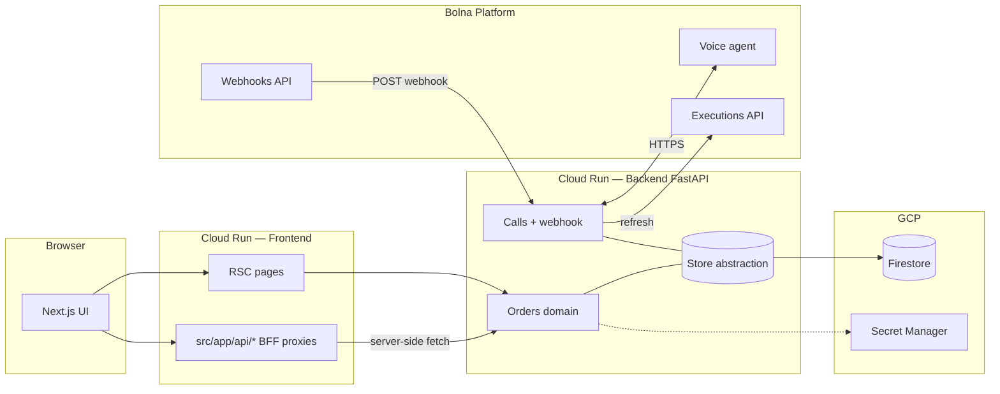

# Bolna Full-Stack Assignment — RTO Shield Ops Console

Voice-AI–assisted **pre-dispatch verification** for high–RTO-risk COD orders: operators trigger Bolna outbound calls from a production-style dashboard, ingest completion via webhook (with **idempotency** + **manual refresh**), persist state in **Firestore**, and ship on **Google Cloud Run** with **path-scoped CI/CD** and **Docker smoke tests** before every deploy.

This repository is structured to pass the [Bolna Full Stack Assignment](Full%20Stack%20Assignment.md) bar: real enterprise use case, Bolna agent integration, full-stack product surface, demonstrable end-to-end flow, plus **GitHub + hosted URLs** for reviewers.

---

## Table of contents

- [Problem & outcome](#problem--outcome)
- [End-to-end architecture](#end-to-end-architecture)
- [Tech stack](#tech-stack)
- [Repository layout](#repository-layout)
- [Prerequisites](#prerequisites)
- [Local development](#local-development)
- [Configuration](#configuration)
- [Testing](#testing)
- [CI/CD & cloud deployment](#cicd--cloud-deployment)
- [Operational notes (Bolna, Firestore, reliability)](#operational-notes-bolna-firestore-reliability)
- [Assignment checklist](#assignment-checklist)

---

## Problem & outcome

**Use case (summary):** Commerce teams lose margin when cash-on-delivery orders are confirmed at checkout but **reject or reschedule at the door** (RTO). A short **Hindi/English voice check** before dispatch reduces “surprise” handoffs and cleans the dispatch queue.

**Workflow (operator view):**

1. Orders land in the dashboard (seeded demo + Firestore in prod).
2. Operator hits **Verify** → backend instructs Bolna to place the call (with context: SKU, amount, address).
3. On call completion, Bolna posts a **webhook**; backend normalizes extraction, updates order status, stores transcript snapshot.
4. If webhook payloads are incomplete, operator uses **Refresh** to pull **`GET /executions/{id}`** and reconcile.

**Defined outcome metric:** uplift in **“confirmed dispatchable”** vs **“reschedule / address change / hard reject”** — see deeper narrative in [`USE_CASE.md`](USE_CASE.md).

---

## End-to-end architecture



**Design intent**

- **BFF-style Next routes** (`/api/orders/...`) keep the browser talking to **same-origin** handlers; FastAPI URLs and keys stay server-side — better than exposing admin backends to arbitrary origins.
- **Store protocol** (`memory` locally / tests, `Firestore` in prod): domain code stays ignorant of persistence backend.
- **Webhook + polling**: async voice stacks are unreliable at the edges; **`POST …/refresh`** is a deterministic escape hatch without weakening idempotency for duplicate deliveries.

---

## Tech stack

| Layer | Choice | Rationale |
|--------|--------|-----------|
| Voice / LLM runtime | **Bolna** | Assignment constraint; agent + telephony + execution APIs. |
| API | **FastAPI** + Pydantic v2 | Typed contracts, async I/O, OpenAPI for integrators. |
| Persistence | **Firestore** (prod) + in-memory (dev/test) | Serverless, no connection pool drama on Cloud Run; explicit `STORE_BACKEND` switch. |
| Web | **Next.js 16** App Router, **TypeScript** | RSC for initial data, route handlers for mutations, strong typing end-to-end. |
| UI | **Tailwind v4**, **shadcn/ui**, **TanStack Query** | Fast iteration, accessible primitives, client cache with server truth. |
| Quality | **pytest**, **Vitest**, **ESLint**, **tsc** | CI gate before merge; Vitest colocated under `frontend/src/tests`. |
| Delivery | **Docker** + **Cloud Run** + **Artifact Registry** | Immutable artifacts, scale-to-zero cost profile, regional proximity (`asia-south1` images; Firestore DB may be multi-region). |
| CI auth | **GitHub OIDC → GCP WIF** | No long-lived JSON keys in GitHub secrets. |

---

## Repository layout

```text
.
├── backend/                 # FastAPI — domains/orders, domains/calls, shared/bolna_client
├── frontend/                # Next.js — canonical code under frontend/src/
├── .github/workflows/
│   ├── ci.yml               # Every push/PR — backend pytest + frontend lint/type/test
│   ├── deploy-backend.yml   # main + backend/** → build → smoke → push → Cloud Run
│   └── deploy-frontend.yml # main + frontend/** → …
├── USE_CASE.md              # Expanded business + workflow prose
├── Full Stack Assignment.md # Original brief (submission checklist)
└── AGENTS.md                # Repo-level pointer to frontend/backend agent guides
```

Frontend structure follows **`frontend/AGENTS.md`** (`src/` as root for app code). Backend follows **`backend/AGENTS.md`** (Router → Service → Repository → Mutator).

---

## Prerequisites

- **Python 3.12+** (backend)
- **Node.js 20+** & **npm 11** (frontend — lockfile aligns with Docker `corepack` npm in CI image)
- **Docker** (optional — mirrors production builds)
- **Google Cloud SDK** (`gcloud`) — only when touching deployed infra or Firestore emulator alternatives

---

## Local development

### Backend

```bash
cd backend
python3 -m venv .venv
source .venv/bin/activate          # Windows: .venv\Scripts\activate
pip install -r requirements.txt -r requirements-dev.txt
cp .env.example .env                  # Fill Bolna + optional FIRESTORE_PROJECT
export STORE_BACKEND=memory           # default; omit FIRESTORE locally
uvicorn app.main:app --reload --port 8000
```

- OpenAPI: `http://localhost:8000/docs`
- Health: `GET /health`

### Frontend

```bash
cd frontend
npm install -g npm@11.8.0           # match CI/Docker npm major if lockfile picky
npm ci
cp .env.example .env.local          # BACKEND_API_URL=http://localhost:8000
npm run dev                         # http://localhost:3000
```

Scripts: `npm run lint`, `npm run typecheck`, `npm test`.

---

## Configuration

### Backend (environment)

| Variable | Purpose |
|-----------|---------|
| `STORE_BACKEND` | `memory` (default / tests) or `firestore` |
| `GCP_PROJECT_ID` | Required when `STORE_BACKEND=firestore` |
| `BOLNA_API_KEY`, `BOLNA_AGENT_ID` | Bolna API |
| `BOLNA_API_BASE_URL` | Bolna REST base URL (production value must come from **GitHub Variable** → Cloud Run, not committed) |
| `DEMO_RECIPIENT_NUMBER` | Optional demo routing override |
| `BOLNA_WEBHOOK_SHARED_SECRET` | Optional shared-secret verification for webhooks |
| `CORS_ORIGINS` | Comma-separated origins (must include deployed Next URL alongside `credentials` middleware) |

Copy from `backend/.env.example`.

### Frontend

| Variable | Scope |
|-----------|-------|
| `BACKEND_API_URL` | Server-only — RSC & route handlers (`src/lib/api.ts`) |
| `NEXT_PUBLIC_BACKEND_API_URL` | Build-time/public mirror — keep aligned for any client paths |

Copy from `frontend/.env.example`.

---

## Testing

```bash
# Backend
cd backend && export STORE_BACKEND=memory && pytest -q

# Frontend
cd frontend && npm run typecheck && npm run lint && npm test
```

---

## CI/CD & cloud deployment

**CI (`ci.yml`):** runs on **every push and pull request** — parallel **pytest** and **typecheck + ESLint + Vitest**.

**Deploy workflows:** trigger only on `main`:

- **`backend/**` changed** → `deploy-backend.yml`: Docker build → **container smoke** (`GET /health` on ephemeral port) → push to Artifact Registry → `gcloud run deploy`.
- **`frontend/**` changed** → `deploy-frontend.yml`: same pattern using **`GET /api/health`** (dependency-free probe).

Infrastructure **values are not pinned in source**: deploy workflows validate that required **GitHub Actions Variables / Secrets** exist before building. Runtime config is injected via **Cloud Run env** (plaintext vars from Gh `vars`, secrets from GCP Secret Manager by name).

### GitHub repository — Variables (plaintext)

Set under **Repo → Settings → Secrets and variables → Actions → Variables**. These are referenced from `.github/workflows/*` via `vars.*` — **do not bake them into Dockerfile or `.ts`/.py`** (local `.env*` only for laptop dev).

| Variable | Used by |
|----------|---------|
| `GCP_PROJECT_ID` | Artifact Registry URLs, backend `GCP_PROJECT_ID` env |
| `GCP_REGION` | Deploy region / docker registry hostname |
| `AR_REPO` | Artifact Registry Docker repo id |
| `BACKEND_CLOUD_RUN_SERVICE` | `gcloud run deploy` target (backend) |
| `FRONTEND_CLOUD_RUN_SERVICE` | Same (frontend) |
| `STORE_BACKEND` | Backend Cloud Run **`STORE_BACKEND`** (e.g. `firestore`) |
| `BOLNA_API_BASE_URL` | Backend Cloud Run **`BOLNA_API_BASE_URL`** (e.g. production Bolna API host) |
| `CORS_ORIGINS` | Comma-separated origins (often `http://localhost:3000,<frontend-cloud-run-url>`) |
| `BACKEND_API_URL` | Frontend service server-side **`BACKEND_API_URL`** |
| `NEXT_PUBLIC_BACKEND_API_URL` | Passed as Docker build-arg + mirrored on frontend service |

### GitHub repository — Secrets

| Secret | Purpose |
|--------|---------|
| `GCP_WIF_PROVIDER` | Workload Identity Federation provider resource |
| `GCP_DEPLOY_SA` | Service account GitHub impersonates for push + deploy |
| `BACKEND_RUNTIME_SA` | Cloud Run backend revision identity (Firestore + secrets access) |

### After each deploy

`deploy-*.yml` appends **`BACKEND`** / **`Frontend`** URL lines to the job summary (`gcloud run services describe`). Use that URL for **Bolna webhook configuration**: **`POST /webhooks/bolna`** on the public API origin (route in [`backend/app/domains/calls/router.py`](backend/app/domains/calls/router.py)).

---

## Operational notes (Bolna, Firestore, reliability)

1. **Idempotency:** duplicate webhook deliveries are deduped; “signal present” heuristic avoids locking the row before payload is semantically terminal (see calls service logic).
2. **Refresh path:** **`POST …/refresh`** pulls Bolna execution JSON and feeds the same normalizer — useful when **`extracted_data`** is delayed or empty.
3. **Transcript fallback:** if structured extraction is null but the assistant verbalized canonical tags in-conversation, a **narrow regex miner** derives `outcome_tag` etc. — demo survives flaky extraction pipelines (**not** a substitute for authoritative Bolna config in prod).
4. **Firestore indexes:** composite queries on large collections may need console-created indexes — watch first heavy list endpoints in logs.
5. **CORS:** `allow_credentials=True` forbids wildcard origins; comma-list real HTTPS origins (**frontend + localhost** for dev).

---

## Assignment checklist

| Objective | Where it’s addressed |
|-----------|-------------------------|
| 1 · Enterprise use case | [`USE_CASE.md`](USE_CASE.md) + summary above |
| 2 · Bolna voice agent | Agent config external to repo; backend [`bolna_client.py`](backend/app/shared/bolna_client.py), calls domain |
| 3 · Web app workflow | Next.js dashboard under `frontend/src/` |
| 4 · Full flow demo | Local or deployed: UI → API → Bolna → webhook/refresh → DB |
| 5 · Repo + deployed link | This README + Cloud Run URLs (from Actions summary / `gcloud`, not pinned here) + screen recording _(outside repo)_ |

Submission pack (per assignment): deck + recording → Google Drive folder **`Saurav_kumar_FSE@bolna`** → [submission form](https://forms.gle/g2YpvmjZm4ufb87XA).

---

## License / attribution

Submission project for Bolna hiring flow. Dependencies remain under their respective licenses.
