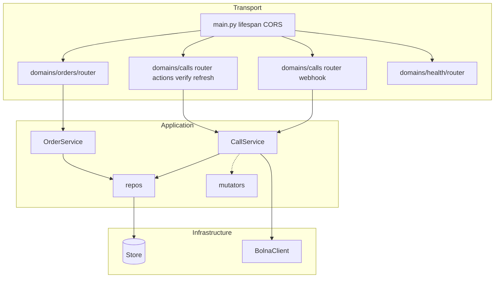

# Backend — RTO Shield (FastAPI)

Python **FastAPI** service: orders lifecycle, Bolna outbound calls, **webhook ingestion**, optional **execution refresh**, and persistence behind a **`Store`** abstraction (**memory** locally / tests, **Firestore** in production on Cloud Run).

> **Monorepo context:** end-to-end architecture, GCP deploy, GitHub Actions variables/secrets, and reliability notes live in [`../README.md`](../README.md).
>
> **Production (GCP Cloud Run):** [API base](https://bolna-backend-3sacqleaea-el.a.run.app) · OpenAPI **[`/docs`](https://bolna-backend-3sacqleaea-el.a.run.app/docs)** · full link table including Bolna webhook: [`README.md` — Live deployments](../README.md#live-deployments).

---

## Contents

1. [Role in the stack](#role-in-the-stack)
2. [Architecture (LLD)](#architecture-lld)
3. [Tech stack](#tech-stack)
4. [Package layout](#package-layout)
5. [Getting started](#getting-started)
6. [Configuration](#configuration)
7. [Testing](#testing)
8. [Docker](#docker)
9. [Further reading](#further-reading)

---

## Role in the stack

| Concern | Responsibility here |
|---------|---------------------|
| **Orders** | CRUD-ish API, seeded demo orders, expose list/detail for dashboard. |
| **Calls / Bolna** | `verify` triggers `BolnaClient.place_call`; webhook + `refresh` normalize payloads into **`CallRepository`** / **`OrderRepository`**. |
| **Durability** | **Idempotent** webhook handling; **`GET /executions/{id}`** refresh shares the same normalisation path. |
| **Persistence** | **`Store`** protocol — `InMemoryStore` vs `FirestoreStore` controlled by **`STORE_BACKEND`**. |

Webhook path (for Bolna console): **`POST /webhooks/bolna`** (see `app/domains/calls/router.py`).

---

## Architecture (LLD)



**Layers (enforced convention):**

`router` → `service` → `repository` → **`Store`** — with **`mutator`** for inbound Bolna-shaped payloads.

Full coding rules: [`AGENTS.md`](AGENTS.md).

---

## Tech stack

| Piece | Choice |
|-------|--------|
| Language | Python **3.12+** |
| Framework | **FastAPI**, **Uvicorn** |
| Validation | **Pydantic v2**, **pydantic-settings** |
| HTTP client | **httpx** (async Bolna calls) |
| Persistence | **`google-cloud-firestore`** when `STORE_BACKEND=firestore` |
| Tests | **pytest**, **pytest-asyncio**, Starlette `TestClient` |

---

## Package layout

```text
backend/
├── app/
│   ├── main.py              # App factory + routers + CORS
│   ├── lifespan.py          # Store connect + demo seed
│   ├── core/                # settings, db.Store, deps, exceptions
│   ├── domains/
│   │   ├── orders/          # router, service, repository, schemas, seed
│   │   ├── calls/           # verify, webhook, refresh, Bolna payloads
│   │   └── health/
│   └── shared/              # bolna_client, constants, utils
├── tests/
├── requirements.txt
├── requirements-dev.txt
├── Dockerfile               # Cloud Run; listens on PORT (default 8080)
└── start.sh                 # Convenience dev launcher
```

---

## Getting started

```bash
cd backend
python3 -m venv .venv
source .venv/bin/activate          # Windows: .venv\Scripts\activate
pip install -r requirements.txt -r requirements-dev.txt
cp .env.example .env               # Fill per Configuration below
export STORE_BACKEND=memory        # local default; use firestore + GCP_PROJECT_ID when wired to GCP
uvicorn app.main:app --reload --port 8000
```

**Or** use `./start.sh` (runs uvicorn similarly once the venv exists).

**Endpoints:**

| URL | Purpose |
|-----|---------|
| http://localhost:8000/docs | Swagger (OpenAPI) |
| http://localhost:8000/redoc | ReDoc |
| `GET /health` | Health check |

---

## Configuration

| Variable | Purpose |
|----------|---------|
| `STORE_BACKEND` | `memory` (default) or `firestore`. |
| `GCP_PROJECT_ID` | Required when `STORE_BACKEND=firestore`. |
| `BOLNA_API_KEY`, `BOLNA_AGENT_ID` | Bolna API credentials (prod: Secret Manager). |
| `BOLNA_API_BASE_URL` | Bolna REST origin — set locally in `.env`; **production via GitHub Variable** → Cloud Run (see root README). |
| `DEMO_RECIPIENT_NUMBER` | Optional outbound override for demos. |
| `CORS_ORIGINS` | Comma-separated origins (must reflect your Next.js origin(s)). |
| `BOLNA_WEBHOOK_SHARED_SECRET` | Optional dev guard for webhooks. |

See [`.env.example`](.env.example).

---

## Testing

```bash
cd backend
source .venv/bin/activate
export STORE_BACKEND=memory
pytest -q
```

Use dependency overrides / fakes where Bolna HTTP is exercised (see `tests/domains/calls/`).

---

## Docker

From the **backend** directory (image expects `PORT` from Cloud Run, default **8080**):

```bash
docker build -t bolna-backend:local .
docker run --rm -p 8080:8080 \
  -e STORE_BACKEND=memory \
  -e BOLNA_API_KEY=dev-placeholder \
  -e BOLNA_AGENT_ID=dev-placeholder \
  -e DEMO_RECIPIENT_NUMBER=+910000000000 \
  bolna-backend:local
```

Then: `curl -s http://localhost:8080/health`.

CI/CD pushes the same Dockerfile to Artifact Registry — see **`../.github/workflows/deploy-backend.yml`** and root [`README.md`](../README.md#ci-and-deployment).

---

## Further reading

- [`AGENTS.md`](AGENTS.md) — layering, naming, dependency rules for this codebase.
- [`../README.md`](../README.md) — assignment overview, API table, GCP + Bolna webhook setup.
