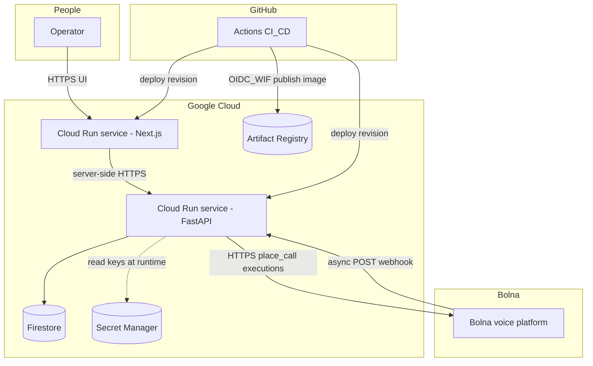
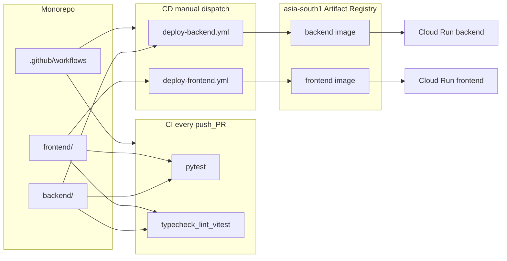
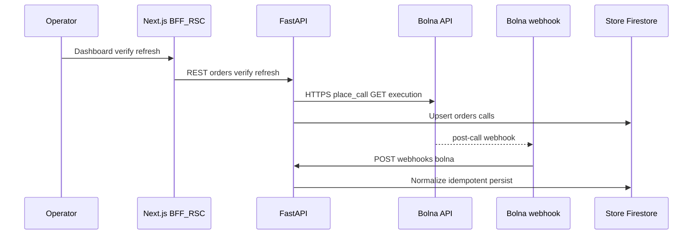
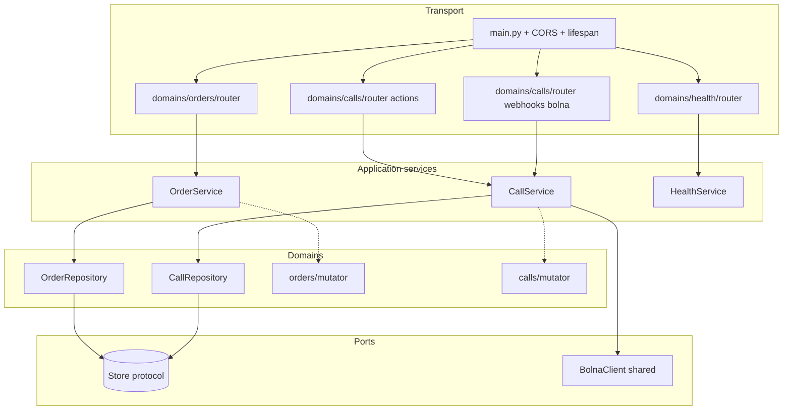
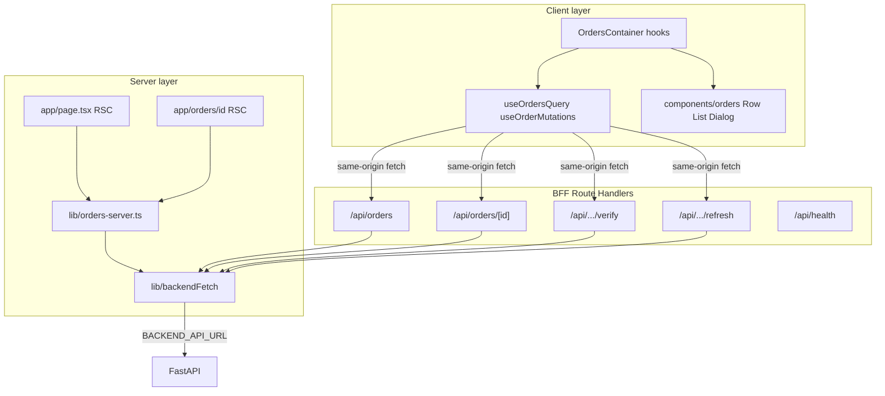

# Architecture

Deep reference for RTO Shield. Split into **HLD** (what exists in the system and how the major pieces talk) and **LLD** (how each codebase is structured internally). For the short version, see the [root README](../README.md).

## Contents

1. [HLD: System context](#hld-system-context)
2. [HLD: Deployment and delivery](#hld-deployment-and-delivery)
3. [HLD: Data and control flows](#hld-data-and-control-flows)
4. [LLD: Backend (FastAPI)](#lld-backend-fastapi)
5. [LLD: Frontend (Next.js App Router)](#lld-frontend-nextjs-app-router)
6. [Design decisions](#design-decisions)
7. [API surface](#api-surface)
8. [Reliability and caveats](#reliability-and-caveats)

---

## HLD: System context

Logical view: **who** touches **which runtime**, and **where data + secrets** live.

**Reading the diagram:**

- **Synchronous path:** Operator → Next (SSR/RSC + BFF routes) → FastAPI → (optional Bolna outbound when the operator clicks Verify).
- **Asynchronous path:** Bolna terminates the call → `POST /webhooks/bolna` → FastAPI updates `Store`; the UI may Refresh to poll executions if the webhook payload was thin.
- **State:** authoritative order + call snapshots in Firestore (cloud) or memory (local/tests).
- **Secrets:** Bolna keys (and the demo phone number) come from Secret Manager at runtime — never from the repo.
- **Supply chain:** images land in Artifact Registry; GitHub deploys both services with WIF (no long-lived GCP JSON keys in GitHub).

---

## HLD: Deployment and delivery

How the **repository** maps to **runtimes** and **pipelines**.

Each deploy workflow: **`docker build` → container smoke on the runner → push digest → `gcloud run deploy`**. Plaintext tuning comes from GitHub Variables; sensitive values from Secret Manager. Details in [`DEPLOYMENT.md`](DEPLOYMENT.md).

---

## HLD: Data and control flows

---

## LLD: Backend (FastAPI)

**Layer model** enforced in-code: **`router` → `service` → `repository` → `Store`**. Cross-cutting **`mutator`** modules normalize external shapes (Bolna webhook / executions) before persistence. **`deps.py`** is the composition root for FastAPI DI.

**Module map (physical):**

| Path | Responsibility |
|------|----------------|
| `app/core/` | `settings`, **`db.Store` + InMemory + Firestore**, `deps`, lifespan wiring |
| `app/domains/orders/` | Orders CRUD, list, **`router`**, **`service`**, **`repository`**, **`mutator`**, Pydantic **`schemas`** |
| `app/domains/calls/` | Verify + refresh flow, webhook ingest, **`CallRepository`** idempotency, **`BolnaWebhookPayload`** |
| `app/shared/bolna_client.py` | `place_call`, `get_execution` over HTTPS |
| `app/domains/health/` | Liveness/readiness-style surface for ops |

Conventions: [`backend/AGENTS.md`](../backend/AGENTS.md).

---

## LLD: Frontend (Next.js App Router)

**Two data planes:** (1) **Server Components + `orders-server`** for first paint / SEO-safe data loading. (2) **Client Components + TanStack Query** calling **`/api/*` route handlers**, so the browser never needs the FastAPI URL or secrets.

**Module map (`frontend/src/`):**

| Area | Responsibility |
|------|----------------|
| `app/` | RSC pages, **`api/**/route.ts`** BFF proxies, layout, loading, `api/health` for container smoke |
| `lib/` | `backendFetch`, `orders-server`, `api-response` helpers |
| `hooks/` | React Query wrappers + mutations + cache invalidation |
| `components/orders/` | Presentational dashboard + dialogs |
| `config/`, `constants/`, `types/`, `query-keys/` | Env, routes, enums, typed API models, query factories |
| `providers/` | `QueryClientProvider`, `Toaster` |

Conventions: [`frontend/AGENTS.md`](../frontend/AGENTS.md).

---

## Design decisions

| Topic | Approach |
|-------|----------|
| **Browser → APIs** | **BFF `/api/*`** keeps FastAPI origins and secrets off the public client surface. |
| **Persistence** | Domains speak **`Store`** only — swap **memory** vs **Firestore** without rewriting repositories. |
| **Voice unreliability** | **Webhook idempotency** + **`refresh` → executions API** share one normalisation pipeline. |

---

## API surface

Full detail in OpenAPI **`/docs`** when the backend is running.

| Method | Path | Purpose |
|--------|------|---------|
| `GET` | `/health` | Liveness / CI smoke |
| `GET` | `/orders` | Paginated list (shape in orders router) |
| `POST` | `/orders` | Create order (demo / ops) |
| `PATCH` | `/orders/{id}` | Update customer / product fields (Bolna-derived fields untouched) |
| `DELETE` | `/orders/{id}` | Remove order + linked call docs |
| `GET` | `/orders/{id}` | Order + last call snapshot |
| `POST` | `/orders/{id}/verify` | Trigger Bolna outbound call |
| `POST` | `/orders/{id}/refresh` | Pull latest Bolna execution + reconcile |
| `GET` | `/orders/{id}/calls` | Call history for order |
| `POST` | `/webhooks/bolna` | Bolna post-call webhook |

The frontend mirrors mutations through **`/api/orders/...`** Next route handlers (BFF). Webhook implementation: [`backend/app/domains/calls/router.py`](../backend/app/domains/calls/router.py).

---

## Reliability and caveats

1. **Webhooks:** deliveries can repeat; the handler is **idempotent** and only "locks" processing when a **meaningful signal** exists (avoids starving late-arriving extractions).
2. **Execution lag:** Bolna `extracted_data` may land after `call-disconnected`; **`refresh`** is the supported reconciliation path.
3. **Transcript mining:** if structured extraction is empty but the assistant spoke tagged outcomes, the backend applies a **narrow regex fallback** — demo resilience, not a replacement for fixing extraction upstream.
4. **Firestore:** first complex list queries may require **composite indexes** (the console suggests the exact YAML).
5. **CORS + credentials:** list every real HTTPS origin explicitly — `*` is illegal while `allow_credentials=True` on FastAPI.
