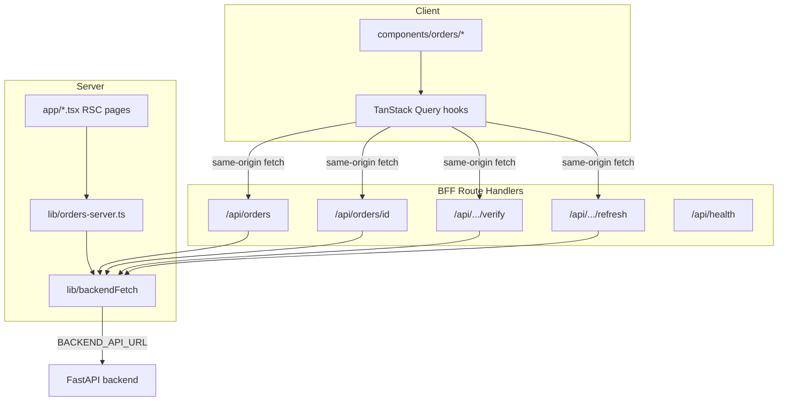

# Frontend — RTO Shield (Next.js)

Next.js **App Router** UI for RTO Shield: operators manage orders, trigger verification calls, and inspect outcomes. All **FastAPI** traffic is reached via **same-origin BFF routes** under `src/app/api/*` so the browser never needs direct access to API keys or cross-origin admin URLs.

> **Monorepo context:** project overview in [`../README.md`](../README.md) · system-level HLD/LLD in [`../docs/ARCHITECTURE.md`](../docs/ARCHITECTURE.md) · CI/CD and Bolna ↔ GCP integration in [`../docs/DEPLOYMENT.md`](../docs/DEPLOYMENT.md).
>
> **Running it:** start locally with the [quick start](../README.md#quick-start) — dashboard on `http://localhost:3000`. The original Cloud Run deployment is offline; see [deployment status](../docs/DEPLOYMENT.md#status).

---

## Contents

1. [Role in the stack](#role-in-the-stack)
2. [Architecture (LLD)](#architecture-lld)
3. [Tech stack](#tech-stack)
4. [Source layout](#source-layout)
5. [Getting started](#getting-started)
6. [Configuration](#configuration)
7. [Scripts](#scripts)
8. [Testing](#testing)
9. [Docker and production](#docker-and-production)
10. [Further reading](#further-reading)

---

## Role in the stack

| Concern | How this app handles it |
|---------|-------------------------|
| **UX** | Dashboard (list + detail), verify / refresh actions, status badges, transcript-friendly detail dialog. |
| **Data access** | **Server:** RSC pages use `lib/orders-server.ts` → `backendFetch` (server-only env). **Client:** TanStack Query calls **`/api/orders/...`** route handlers that proxy to FastAPI. |
| **Security** | `BACKEND_API_URL` is **never** required in the client bundle for current flows; BFF keeps the backend origin on the server. |
| **Health** | `GET /api/health` — dependency-free JSON for Cloud Run / CI smoke (see root README). |

---

## Architecture (LLD)



**Design rules (match root narrative):**

- Prefer **server data** for first paint; use **client cache** for interactive refresh after mutations.
- Keep API route handlers **thin**: validate method, forward to `backendFetch`, map errors with `lib/api-response.ts`.

---

## Tech stack

| Piece | Version / choice |
|-------|------------------|
| Framework | **Next.js 16** (App Router) |
| Language | **TypeScript** |
| Styling | **Tailwind CSS v4** |
| Components | **shadcn/ui** (Radix primitives) |
| Server state | **TanStack Query v5** |
| Tests | **Vitest** + Testing Library (`src/tests/`) |

---

## Source layout

Canonical code lives under **`src/`** (see [`AGENTS.md`](AGENTS.md) for the full house standard).

```text
frontend/src/
├── app/                 # RSC pages, layouts, global loading / not-found
│   └── api/             # BFF: orders + health
├── components/          # UI + feature components (orders/*)
├── config/              # env.ts, routes.ts
├── constants/           # status / outcome label maps
├── hooks/               # useOrdersQuery, useOrderMutations, …
├── lib/                 # backendFetch, orders-server, api-response, utils
├── providers/           # QueryClient + Toaster
├── query-keys/          # React Query key factories
├── types/               # API-aligned TypeScript types
├── utils/               # formatters (currency, dates)
└── tests/               # Vitest specs (flat)
```

---

## Getting started

**Prerequisites:** Node **20+**, **npm 11** (aligns with `Dockerfile` `corepack` npm for `npm ci`).

```bash
cd frontend
npm install -g npm@11.8.0    # if your global npm is older and lockfile rejects npm ci
npm ci
cp .env.example .env.local   # set BACKEND_API_URL for local API (default example: http://localhost:8000)
npm run dev                  # http://localhost:3000
```

Ensure the FastAPI backend is running (see [`../backend/README.md`](../backend/README.md)) when you exercise the full flow.

---

## Configuration

| Variable | Where | Purpose |
|----------|--------|---------|
| `BACKEND_API_URL` | Server only (`.env.local`, Cloud Run) | Base URL for `backendFetch` from RSC and route handlers. |
| `NEXT_PUBLIC_BACKEND_API_URL` | Build + optional client | Public mirror; keep aligned if any client code reads it. |

Templates: [`.env.example`](.env.example). Cloud values are injected via GitHub Variables → Cloud Run (see [`../docs/DEPLOYMENT.md`](../docs/DEPLOYMENT.md#configuration)).

---

## Scripts

| Command | Purpose |
|---------|---------|
| `npm run dev` | Next dev server |
| `npm run build` | Production build (standalone output for Docker) |
| `npm run start` | Serve production build locally |
| `npm run lint` | ESLint |
| `npm run typecheck` | `tsc --noEmit` |
| `npm test` | Vitest once |
| `npm run test:watch` | Vitest watch |

---

## Testing

```bash
cd frontend
npm run typecheck && npm run lint && npm test
```

Tests live in **`src/tests/`** (flat filenames next to the modules they cover).

---

## Docker and production

```bash
cd frontend
docker build \
  --build-arg NEXT_PUBLIC_BACKEND_API_URL="https://your-backend-host" \
  -t bolna-frontend:local .
```

The image listens on **`PORT=8080`** (Cloud Run). Multi-stage build details: [`Dockerfile`](Dockerfile).

Deploy workflow: **[`.github/workflows/deploy-frontend.yml`](../.github/workflows/deploy-frontend.yml)** — manual (`workflow_dispatch`); see [`../docs/DEPLOYMENT.md`](../docs/DEPLOYMENT.md).

---

## Further reading

- [`AGENTS.md`](AGENTS.md) — structure, patterns, and conventions for this codebase.
- [`design.md`](design.md) / [`design-pattern.md`](design-pattern.md) — UI and composition notes.
- [`../README.md`](../README.md) — project overview and quick start.
- [`../docs/ARCHITECTURE.md`](../docs/ARCHITECTURE.md) — full HLD/LLD, module maps, API surface.
- [`../docs/DEPLOYMENT.md`](../docs/DEPLOYMENT.md) — CI/CD, GCP setup, Bolna webhook target.
